# Лабораторная работа №2
## Однослойный перцептрон: реализация, обучение и анализ
### Автор: Плотников Андрей, Б25-507

#### 1. Подготовка данных.
Сгенерирую набор данных для  бинарной классификации с двумя
числовыми признаками с помощью функции  make_classification из
sklearn.datasets. Генерация данных вынесена в отдельный класс ```DataProvider```, чтобы затем использовать эти же данные для обучения разных моделей. 


```python
import numpy as np
from sklearn.datasets import make_classification
import matplotlib.pyplot as plt

class DataProvider:
    def __init__(self, n_samples=500, seed=42):
        self.n_samples = n_samples
        self.seed = seed
        self.X_train = None
        self.Y_train = None
        self.X_test = None
        self.Y_test = None

    def generate_and_prepare(self):
        X, Y = make_classification(
            n_samples=500,
            n_features=2,
            n_redundant=0,
            n_informative=2,
            random_state=42,
            n_clusters_per_class=1
        )

        rng = np.random.default_rng(seed=42)

        indices_0 = np.where(Y == 0)[0]
        indices_1 = np.where(Y == 1)[0]

        rng.shuffle(indices_0)
        rng.shuffle(indices_1)

        split_0 = int(len(indices_0) * 0.7)
        split_1 = int(len(indices_1) * 0.7)

        train_idx = np.concatenate([indices_0[:split_0], indices_1[:split_1]])
        test_idx = np.concatenate([indices_0[split_0:], indices_1[split_1:]])

        rng.shuffle(train_idx)
        rng.shuffle(test_idx)

        X_train, Y_train = X[train_idx], Y[train_idx]
        X_test, Y_test = X[test_idx], Y[test_idx]
        mu = np.mean(X_train, axis=0)
        sigma = np.std(X_train, axis=0)

        self.X_train = (X_train - mu) / sigma
        self.X_test = (X_test - mu) / sigma
        self.Y_train = Y_train
        self.Y_test = Y_test
        return self.X_train, self.Y_train, self.X_test, self.Y_test
```

Для генерации данных я использовал параметры данные в задании. Затем стратифицировал и стандартизировал (Z-score) признаки, применил полученные данные к тестовой выборке.

#### 2. Реализация перцептрона


```python
class Perceptron:
    def __init__(self):
        self.w = None
        self.b = None
        self.train_loss_history = []
        self.val_loss_history = []

    def sigmoid(self, z):
        z = np.clip(z, -250, 250)
        return 1 / (1 + np.exp(-z))

    def forward(self, X):
        return self.sigmoid(np.dot(X, self.w) + self.b)

    def compute_loss(self, y_true, y_pred):
        eps = 1e-15
        y_pred = np.clip(y_pred, eps, 1 - eps)
        return -np.mean(y_true * np.log(y_pred) + (1 - y_true) * np.log(1 - y_pred))

    def fit(self, X_train, y_train, X_val, y_val, epochs=100, lr=0.1, batch_size=32, init_type='small_random'):
        n_samples, n_features = X_train.shape

        if init_type == 'zeros':
            self.w = np.zeros(n_features)
        elif init_type == 'large_random':
            self.w = np.random.randn(n_features) * 10.0
        else:
            self.w = np.random.randn(n_features) * 0.01

        self.b = 0.0
        self.train_loss_history = []
        self.val_loss_history = []

        for epoch in range(epochs):
            indices = np.arange(n_samples)
            np.random.shuffle(indices)
            X_shuffled = X_train[indices]
            y_shuffled = y_train[indices]

            for i in range(0, n_samples, batch_size):
                X_batch = X_shuffled[i:i + batch_size]
                y_batch = y_shuffled[i:i + batch_size]
                m_batch = X_batch.shape[0]

                y_pred = self.forward(X_batch)

                dw = np.dot(X_batch.T, (y_pred - y_batch)) / m_batch
                db = np.sum(y_pred - y_batch) / m_batch

                self.w -= lr * dw
                self.b -= lr * db

            self.train_loss_history.append(self.compute_loss(y_train, self.forward(X_train)))
            self.val_loss_history.append(self.compute_loss(y_val, self.forward(X_val)))

    def predict(self, X):
        return (self.forward(X) >= 0.5).astype(int)
```

##### Реализация включает:
- Возможность инициализации с различными весами (по умолчанию с небольшими случайными значениями, но можно также с нулевыми весами, большими весами) и b = 0.
- Сигмоидную функцию активации ```sigmoid(z)```. Удобна для градиентного обучения благодаря гладкости и простоте. (Примечание: np.clip ограничивает z диапозоном от -250 до 250 включительно, чтобы избежать переполнения)
- Прямой проход ```forward```. Возвращает вектор предсказанных вероятностей для каждого объекта.
- Функцию потерь ```compute_loss(y_true, y_pred)``` (бинарная кросс-энтропия). Она возвращает ˆy для входной матрицы X.
- Метод ```fit``` - **обучение с мини‑батчами**
    - Модели обучаются с помощью **градиентного спуска по мини‑батчам**: на каждой эпохе данные случайно перемешиваются и разбиваются на небольшие группы (батчи). Для каждого батча вычисляются предсказания $\hat{y} = \sigma(Xw + b)$, а затем градиенты функции потерь (бинарной кросс‑энтропии):

$$
\frac{\partial L}{\partial w} = \frac{1}{m} X^T (\hat{y} - y), \qquad \frac{\partial L}{\partial b} = \frac{1}{m} \sum (\hat{y} - y).
$$

Веса обновляются в направлении, противоположном градиенту:

$$
w \leftarrow w - \eta \frac{\partial L}{\partial w}, \qquad b \leftarrow b - \eta \frac{\partial L}{\partial b},
$$

где $\eta$ — скорость обучения. После каждой полной эпохи сохраняются значения потерь на обучающей и валидационной выборках для контроля сходимости.


#### 3. Обучение и визуализация

Обучил перцептрон на подготовленных данных с гиперпараметрами: η = 0.1, количество эпох = 100, размер батча = 32


```python
data = DataProvider()
X_train, Y_train, X_test, Y_test = data.generate_and_prepare()
model = Perceptron()
model.fit(X_train, Y_train, X_test, Y_test, epochs=100, lr=0.1, batch_size=32)
```

Построил графики изменения функции потерь на обучающей и валидационной выборках в зависимости от эпохи:


```python
plt.figure(figsize=(14, 5))

plt.subplot(1, 2, 1)
plt.plot(model.train_loss_history, label='Train Loss', lw=2)
plt.plot(model.val_loss_history, label='Val Loss', lw=2, linestyle='--')
plt.title('Кривая обучения (Loss)')
plt.xlabel('Эпоха')
plt.ylabel('Loss')
plt.legend()
plt.grid(True)
plt.tight_layout()
plt.show()
```


    
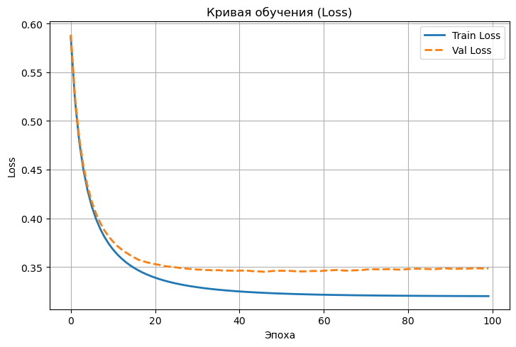
    


График демонстрирует успешную минимизацию функции потерь $L(\theta)$ алгоритмом оптимизации. Мы видим правильное схождение модели без переобучения. В первые 20 эпох наблюдается резкое экспоненциальное падение ошибок, означающее быстрое извлечение моделью главных закономерностей из данных, после чего производная функции потерь $\frac{dL}{d(\text{Epoch})}$ стремится к нулю. После 40-й эпохи кривые выходят на стабильное асимптотическое плато: $Loss_{train} \to 0.32$, а $Loss_{val} \to 0.35$, и поскольку ошибка на проверочной выборке не начинает расти вверх (то есть градиент $Loss_{val}$ на поздних этапах не становится положительным), модель достигла оптимального баланса смещения и дисперсии, делая дальнейшие вычисления после 50-й эпохи математически нецелесообразными.

Вычислил точность (accuracy) на обучающей и тестовой выборках после обучения (для удобства вывода написал функцию print_metrics):


```python
def print_metrics(name, y_true, y_pred):
    tp = np.sum((y_true == 1) & (y_pred == 1))
    tn = np.sum((y_true == 0) & (y_pred == 0))
    fp = np.sum((y_true == 0) & (y_pred == 1))
    fn = np.sum((y_true == 1) & (y_pred == 0))

    acc = (tp + tn) / len(y_true)
    prec = tp / (tp + fp) if (tp + fp) > 0 else 0
    rec = tp / (tp + fn) if (tp + fn) > 0 else 0
    f1 = 2 * prec * rec / (prec + rec) if (prec + rec) > 0 else 0

    print(f"--- Метрики: {name} ---")
    print(f"Accuracy:  {acc:.4f}")
    print(f"Precision: {prec:.4f}")
    print(f"Recall:    {rec:.4f}")
    print(f"F1-score:  {f1:.4f}\n")


print_metrics("Обучающая выборка", Y_train, model.predict(X_train))
print_metrics("Тестовая выборка", Y_test, model.predict(X_test))
```

    --- Метрики: Обучающая выборка ---
    Accuracy:  0.8825
    Precision: 0.8681
    Recall:    0.9029
    F1-score:  0.8852
    
    --- Метрики: Тестовая выборка ---
    Accuracy:  0.8675
    Precision: 0.9000
    Recall:    0.8289
    F1-score:  0.8630
    
    

Точность перцептрона очень высока. На реальных («грязных») данных перцептрон никогда не выдаст 90%. Но для этой конкретной синтетической выборки такой результат ожидаем.

Визуализировал разделяющую границу (прямую $w^Tx + b = 0$) на фоне точек
данных.


```python
plt.figure(figsize=(14, 5))
plt.subplot(1, 2, 2)

plt.scatter(X_train[Y_train == 0, 0], X_train[Y_train == 0, 1], c='blue', label='Класс 0', alpha=0.5)
plt.scatter(X_train[Y_train == 1, 0], X_train[Y_train == 1, 1], c='orange', label='Класс 1', alpha=0.5)

x0_vals = np.array([X_train[:, 0].min() - 0.5, X_train[:, 0].max() + 0.5])
x1_vals = -(model.w[0] * x0_vals + model.b) / model.w[1]

plt.plot(x0_vals, x1_vals, c='green', lw=2, label='Граница')

plt.title('Разделяющая граница')
plt.xlabel('Признак 1')
plt.ylabel('Признак 2')
plt.xlim(x0_vals)
plt.ylim(X_train[:, 1].min() - 0.5, X_train[:, 1].max() + 0.5)
plt.legend()
plt.grid(True)
plt.tight_layout()
plt.show()
```


    
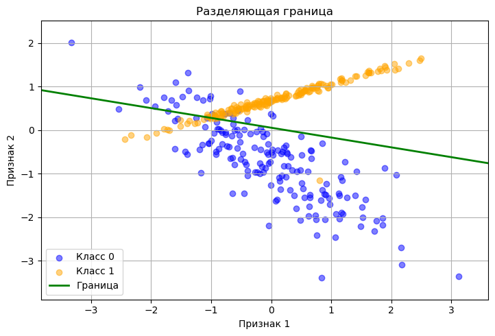
    


Визуализация разделяющей границы подтверждает фундаментальное ограничение линейных моделей — данные оказались линейно неразделимыми (класс 1 выстроен в линию, а класс 0 образует облако, накрывающее эту линию), поэтому перцептрон вынужден искать математический компромисс, что и даёт полученные ~87–88% точности. Именно этим объясняется плато на графике потерь после 40-й эпохи: модель не переобучилась, а достигла архитектурного потолка, и для дальнейшего повышения качества необходимы нелинейные алгоритмы (многослойные сети, случайный лес, SVM с нелинейным ядром).

#### 4. Эксперименты и анализ

Проведу эксперимент, как меняется сходимость при различной скорости обучения


```python
data = DataProvider()
X_train, Y_train, X_test, Y_test = data.generate_and_prepare()
lrs = [0.001, 0.01, 0.5, 1.0]
plt.figure(figsize=(14, 5))
print(f"{'Learning Rate':<15} | {'Train Accuracy':<15} | {'Test Accuracy':<15}")
print("-" * 53)

for lr in lrs:
    np.random.seed(42)
    model = Perceptron()
    model.fit(X_train, Y_train, X_test, Y_test, epochs=100, lr=lr, batch_size=32)

    train_acc = np.mean(model.predict(X_train) == Y_train)
    test_acc = np.mean(model.predict(X_test) == Y_test)
    print(f"{lr::<15} | {train_acc:<15.4f} | {test_acc:<15.4f}")

    plt.subplot(1, 2, 1)
    plt.plot(model.train_loss_history, label=f'lr={lr}')
    plt.subplot(1, 2, 2)
    plt.plot(model.val_loss_history, label=f'lr={lr}', linestyle='--')

plt.subplot(1, 2, 1)
plt.title('Train Loss для разных lr')
plt.xlabel('Эпоха')
plt.ylabel('Loss')
plt.legend()
plt.grid(True)

plt.subplot(1, 2, 2)
plt.title('Val Loss для разных lr')
plt.xlabel('Эпоха')
plt.ylabel('Loss')
plt.legend()
plt.grid(True)

plt.tight_layout()
plt.show()
```

    Learning Rate   | Train Accuracy  | Test Accuracy  
    -----------------------------------------------------
    0.001:::::::::: | 0.8768          | 0.8477         
    0.01::::::::::: | 0.8825          | 0.8609         
    0.5:::::::::::: | 0.8825          | 0.8609         
    1.0:::::::::::: | 0.8825          | 0.8609         
    


    
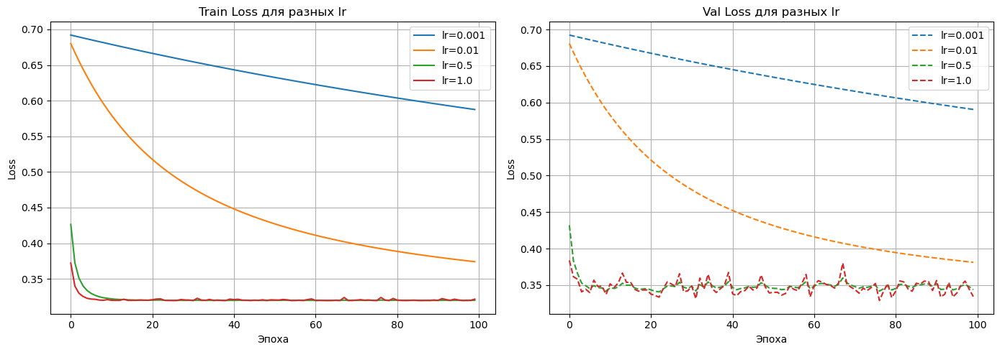
    


Скорость обучения (learning rate, $\eta$) определяет размер шага градиентного спуска при обновлении весов $w^{(t+1)} = w^{(t)} - \eta \nabla L(w^{(t)})$: при малом $\eta = 0.001$ сходимость слишком медленная, так как градиентный спуск делает микроскопические шаги и не успевает достичь минимума за 100 эпох. Это отражается в высокой функции потерь. При $\eta = 0.01$ сходимость становится стабильной и плавной, позволяя эффективно приближаться к оптимуму; при увеличении $\eta$ до $0.5$ и $1.0$ достигается крайне быстрая сходимость в первые эпохи, однако из-за большого размера шага график потерь начинает "дрожать" вокруг минимума, так как алгоритм "перепрыгивает" оптимальную точку, но это не препятствует достижению максимальной точности. Оптимальным значением является $0.01$.

Теперь сравню скорость сходимости и итоговую точность в зависимости от размера батча.


```python
data = DataProvider()
X_train, Y_train, X_test, Y_test = data.generate_and_prepare()

batches = [1, 16, 64, 256]

plt.figure(figsize=(14, 5))
print(f"{'Batch Size':<15} | {'Train Accuracy':<15} | {'Test Accuracy':<15}")
print("-" * 53)

for bs in batches:
    np.random.seed(42)
    model = Perceptron()
    model.fit(X_train, Y_train, X_test, Y_test, epochs=100, lr=0.1, batch_size=bs)

    train_acc = np.mean(model.predict(X_train) == Y_train)
    test_acc = np.mean(model.predict(X_test) == Y_test)
    print(f"{bs:<15} | {train_acc:<15.4f} | {test_acc:<15.4f}")

    plt.subplot(1, 2, 1)
    plt.plot(model.train_loss_history, label=f'batch={bs}')
    plt.subplot(1, 2, 2)
    plt.plot(model.val_loss_history, label=f'batch={bs}', linestyle='--')

plt.subplot(1, 2, 1)
plt.title('Train Loss для разных батчей')
plt.xlabel('Эпоха')
plt.ylabel('Loss')
plt.legend()
plt.grid(True)

plt.subplot(1, 2, 2)
plt.title('Val Loss для разных батчей')
plt.xlabel('Эпоха')
plt.ylabel('Loss')
plt.legend()
plt.grid(True)

plt.tight_layout()
plt.show()
```

    Batch Size      | Train Accuracy  | Test Accuracy  
    -----------------------------------------------------
    1               | 0.8768          | 0.8477         
    16              | 0.8825          | 0.8675         
    64              | 0.8825          | 0.8609         
    256             | 0.8797          | 0.8675         
    


    
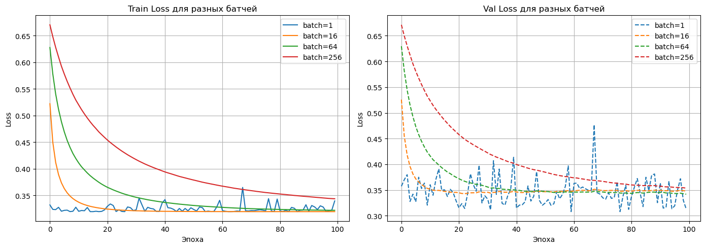
    


Размер батча (batch size, $B$) определяет количество примеров, используемых для оценки градиента на одной итерации: $w^{(t+1)} = w^{(t)} - \frac{\eta}{B} \sum_{i=1}^{B} \nabla L(w^{(t)}, x_i)$. При малом $B=1$ (стохастический градиентный спуск) обновление весов происходит по каждому примеру, что вносит высокий уровень шума в оценку градиента и приводит к резким осцилляциям ("дрожаниям") функции потерь, однако позволяет быстрее "выскакивать" из локальных минимумов. Напротив, при больших $B=256$ (пакетный градиентный спуск) оценка градиента становится высокостабильной и гладкой, но требует больше шагов (эпох) для достижения аналогичного значения функции потерь, так как обновление весов происходит реже в пересчете на один проход по всему датасету. Наиболее сбалансированным выбором является $16$ или $64$.

Сравю теперь нулевую инициализацию, маленькие случайные веса и инициализацию большими значениями


```python
data = DataProvider()
X_train, Y_train, X_test, Y_test = data.generate_and_prepare()

initializations = ['zeros', 'small_random', 'large_random']

plt.figure(figsize=(14, 5))
print(f"{'Initialization':<15} | {'Train Accuracy':<15} | {'Test Accuracy':<15}")
print("-" * 53)

for init in initializations:
    np.random.seed(42)
    model = Perceptron()
    model.fit(X_train, Y_train, X_test, Y_test, epochs=100, lr=0.1, batch_size=32, init_type=init)

    train_acc = np.mean(model.predict(X_train) == Y_train)
    test_acc = np.mean(model.predict(X_test) == Y_test)
    print(f"{init:<15} | {train_acc:<15.4f} | {test_acc:<15.4f}")

    plt.subplot(1, 2, 1)
    plt.plot(model.train_loss_history, label=f'{init}')
    plt.subplot(1, 2, 2)
    plt.plot(model.val_loss_history, label=f'{init}', linestyle='--')

plt.subplot(1, 2, 1)
plt.title('Train Loss для разных инициализаций')
plt.xlabel('Эпоха')
plt.ylabel('Loss')
plt.legend()
plt.grid(True)

plt.subplot(1, 2, 2)
plt.title('Val Loss для разных инициализаций')
plt.xlabel('Эпоха')
plt.ylabel('Loss')
plt.legend()
plt.grid(True)

plt.tight_layout()
plt.show()
```

    Initialization  | Train Accuracy  | Test Accuracy  
    -----------------------------------------------------
    zeros           | 0.8825          | 0.8675         
    small_random    | 0.8825          | 0.8675         
    large_random    | 0.8825          | 0.8675         
    


    
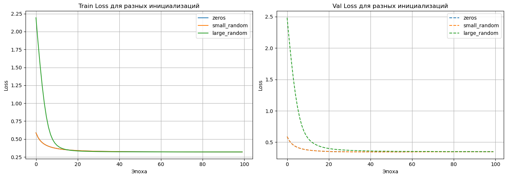
    


Инициализация нулями ($w=0$) в нейронных сетях приводит к проблеме симметрии, при которой все нейроны в слое обучаются одинаково, превращая модель в линейный классификатор с ограниченными выразительными способностями; малые случайные веса (например, из распределения $\mathcal{N}(0, 0.01^2)$) позволяют нарушить эту симметрию, обеспечивая эффективное обучение и стабильное падение функции потерь, тогда как инициализация большими значениями (например, $\mathcal{N}(0, 10^2)$) приводит к насыщению функций активации (например, сигмоиды), где градиент $\nabla L$ становится крайне малым, вызывая "затухание градиентов" и очень медленное начало обучения, как видно на графике высокого начального значения Loss для large_random. Оптимальный вариант: маленькие случайные веса.

## Задания на дополнительные баллы

###  1. Собственный генератор данных

Реализовал функцию генерации синтетических данных для бинарной классификации в двумерном пространстве


```python
def generate(data_type='linear', n_samples=500, noise=0.05, seed=42):
    rng = np.random.default_rng(seed)

    if data_type == 'linear':
        X = rng.standard_normal((n_samples, 2))
        X[:n_samples // 2] += [2, 2]
        X[n_samples // 2:] += [-2, -2]
        Y = np.array([0] * (n_samples // 2) + [1] * (n_samples // 2))
    elif data_type == 'xor':
        X = rng.standard_normal((n_samples, 2))
        Y = (X[:, 0] * X[:, 1] > 0).astype(int)
    elif data_type == 'circle':
        X = rng.standard_normal((n_samples, 2))
        Y = (np.sqrt(X[:, 0] ** 2 + X[:, 1] ** 2) > 1.2).astype(int)

    if noise > 0:
        mask = rng.random(n_samples) < noise
        Y[mask] = 1 - Y[mask]

    indices_0 = np.where(Y == 0)[0]
    indices_1 = np.where(Y == 1)[0]
    rng.shuffle(indices_0)
    rng.shuffle(indices_1)

    split_0 = int(len(indices_0) * 0.7)
    split_1 = int(len(indices_1) * 0.7)

    train_idx = np.concatenate([indices_0[:split_0], indices_1[:split_1]])
    test_idx = np.concatenate([indices_0[split_0:], indices_1[split_1:]])
    rng.shuffle(train_idx)
    rng.shuffle(test_idx)

    X_train, Y_train = X[train_idx], Y[train_idx]
    X_test, Y_test = X[test_idx], Y[test_idx]

    mu = np.mean(X_train, axis=0)
    sigma = np.std(X_train, axis=0)

    X_train = (X_train - mu) / sigma
    X_test = (X_test - mu) / sigma
    return X_train, Y_train, X_test, Y_test
```

**Функция позволяет:**
- Генерировать два гауссовых облака с заданными центрами и ковариационной матрицей
- Генерировать  «xor» — точки в углах квадрата
- Генерировать «окружность» — точки внутри/снаружи круга
- Добавлять контролируемый уровень шума

Визуализирую сгенерированные данные. Класс 0 - синие точки, класс 1 - красные крестики. Покажу данные и тренировочной, и тестовой выборок


```python
data_types = ['linear', 'xor', 'circle']

fig, axes = plt.subplots(3, 2, figsize=(12, 15))

for i, dtype in enumerate(data_types):
    X_train, Y_train, X_test, Y_test = generate(data_type=dtype, n_samples=600, noise=0.05, seed=42)
    
    ax_train = axes[i, 0]
    
    ax_train.scatter(X_train[Y_train == 0, 0], X_train[Y_train == 0, 1], color='blue', alpha=0.6, label='Class 0')
    ax_train.scatter(X_train[Y_train == 1, 0], X_train[Y_train == 1, 1], color='red', marker='x', alpha=0.6, label='Class 1')
    ax_train.set_title(f'{dtype.upper()} - Train Split')
    ax_train.set_xlabel('Feature 1')
    ax_train.set_ylabel('Feature 2')
    ax_train.grid(True, linestyle='--', alpha=0.5)
    ax_train.legend()
    
    ax_test = axes[i, 1]
    ax_test.scatter(X_test[Y_test == 0, 0], X_test[Y_test == 0, 1], color='blue', alpha=0.6, label='Class 0')
    ax_test.scatter(X_test[Y_test == 1, 0], X_test[Y_test == 1, 1], color='red', marker='x', alpha=0.6, label='Class 1')
    ax_test.set_title(f'{dtype.upper()} - Test Split')
    ax_test.set_xlabel('Feature 1')
    ax_test.set_ylabel('Feature 2')
    ax_test.grid(True, linestyle='--', alpha=0.5)
    ax_test.legend()

plt.tight_layout()
plt.show()
```


    
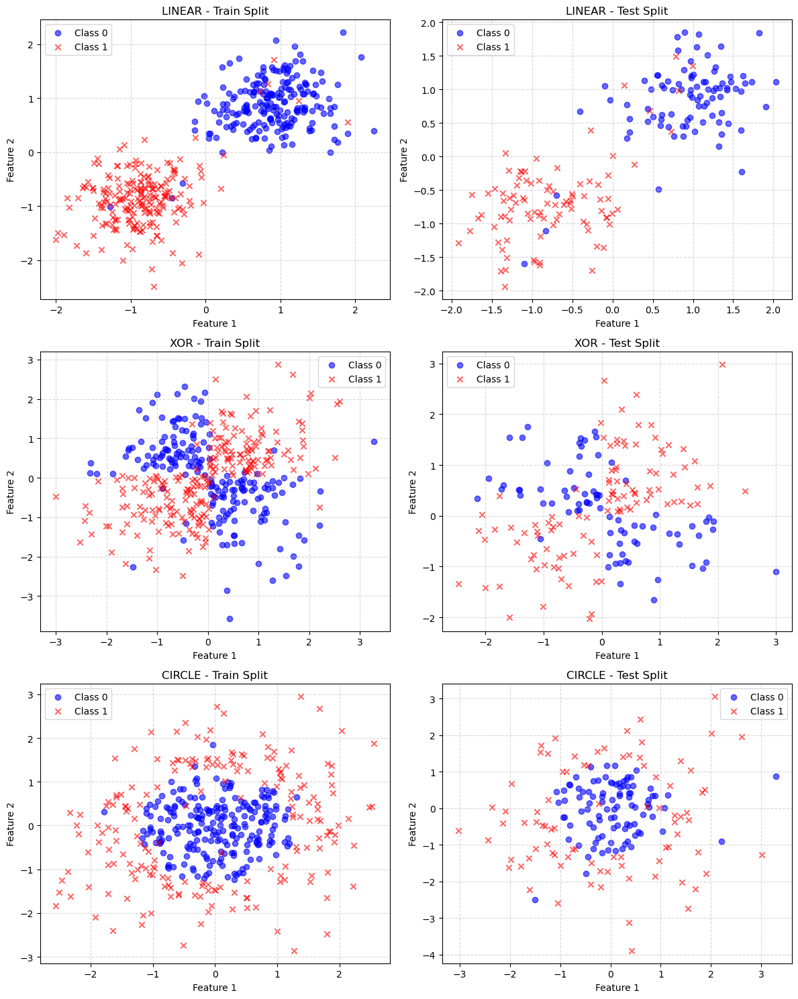
    


Обучил перцептрон на этих данных.


```python
results = {}
for dtype in ['linear', 'xor', 'circle']:
    X_train, Y_train, X_test, Y_test = generate(data_type=dtype)
    model = Perceptron()
    model.fit(X_train, Y_train, X_test, Y_test, epochs=50)

    preds = model.predict(X_test)
    accuracy = np.mean(preds == Y_test)
    results[dtype] = accuracy

print(f"{'Тип данных':<15} | {'Точность (Accuracy)':<20}")
print("-" * 38)
for k, v in results.items():
    print(f"{k:<15} | {v:.2%}")
```

    Тип данных      | Точность (Accuracy) 
    --------------------------------------
    linear          | 98.01%
    xor             | 56.95%
    circle          | 53.64%
    

Классификация с помощью перцептрона успешна только для линейно разделимых данных (как в случае «linear»), где модель способна провести одну прямую границу, четко разделяющую классы, тогда как на данных типа «XOR» и «окружность» перцептрон терпит неудачу, показывая точность на уровне случайного угадывания, поскольку классы в этих задачах переплетены и не могут быть разделены прямой линией. Фундаментальная граница применимости перцептрона заключается именно в этой жесткой линейности: он пригоден только для простейших задач с линейной зависимостью и не способен самостоятельно выявлять нелинейные закономерности, что делает его непригодным для решения сложных задач без использования многослойных архитектур.

### 2. Дополнительные функции потерь и регуляризация

Для реализации функции потерь Hinge loss обновлю класс перцептрона


```python
class Perceptron:
    def __init__(self, loss_type='cross_entropy'):
        self.w = None
        self.b = None
        self.loss_type = loss_type
        self.train_loss_history = []
        self.val_loss_history = []

    def sigmoid(self, z):
        z = np.clip(z, -250, 250)
        return 1 / (1 + np.exp(-z))

    def forward(self, X):
        z = np.dot(X, self.w) + self.b
        if self.loss_type == 'hinge':
            return z
        return self.sigmoid(z)

    def compute_loss(self, y_true, y_pred):
        if self.loss_type == 'cross_entropy':
            eps = 1e-15
            y_pred = np.clip(y_pred, eps, 1 - eps)
            return -np.mean(y_true * np.log(y_pred) + (1 - y_true) * np.log(1 - y_pred))
        else:
            losses = np.maximum(0, 1 - y_true * y_pred)
            return np.mean(losses)

    def fit(self, X_train, y_train, X_val=None, y_val=None, epochs=100, lr=0.1, batch_size=32, init_type='small_random'):
        n_samples, n_features = X_train.shape
        if init_type == 'zeros':
            self.w = np.zeros(n_features)
        elif init_type == 'large_random':
            self.w = np.random.randn(n_features) * 10.0
        else:
            self.w = np.random.randn(n_features) * 0.01

        self.b = 0.0
        self.train_loss_history = []
        self.val_loss_history = []

        for epoch in range(epochs):
            indices = np.arange(n_samples)
            np.random.shuffle(indices)
            X_shuffled = X_train[indices]
            y_shuffled = y_train[indices]

            for i in range(0, n_samples, batch_size):
                X_batch = X_shuffled[i:i + batch_size]
                y_batch = y_shuffled[i:i + batch_size]
                m_batch = X_batch.shape[0]

                y_pred = self.forward(X_batch)

                if self.loss_type == 'cross_entropy':
                    dw = np.dot(X_batch.T, (y_pred - y_batch)) / m_batch
                    db = np.sum(y_pred - y_batch) / m_batch
                else:
                    mask = (y_batch * y_pred) < 1
                    if np.any(mask):
                        dw = -np.dot(X_batch[mask].T, y_batch[mask]) / m_batch
                        db = -np.sum(y_batch[mask]) / m_batch
                    else:
                        dw = np.zeros_like(self.w)
                        db = 0.0

                self.w -= lr * dw
                self.b -= lr * db

            self.train_loss_history.append(self.compute_loss(y_train, self.forward(X_train)))
            if X_val is not None and y_val is not None:
                self.val_loss_history.append(self.compute_loss(y_val, self.forward(X_val)))

    def predict(self, X):
        if self.loss_type == 'cross_entropy':
            return (self.forward(X) >= 0.5).astype(int)
        else:
            return np.where(self.forward(X) >= 0, 1, -1)
```

Для сравнения буду использовать генератор данных созданный в первом задании базовой части задания


```python
data = DataProvider()
X_train, Y_train, X_test, Y_test = data.generate_and_prepare()
model_ce = Perceptron(loss_type='cross_entropy')
model_ce.fit(X_train, Y_train)
pred_ce = model_ce.predict(X_test)
print_metrics("Cross-Entropy", Y_test, pred_ce)

Y_train_h = np.where(Y_train == 0, -1, 1)
model_h = Perceptron(loss_type='hinge')
model_h.fit(X_train, Y_train_h)
pred_h = model_h.predict(X_test)
pred_h = np.where(pred_h == -1, 0, 1)
print_metrics("Hinge Loss", Y_test, pred_h)
```

    --- Метрики: Cross-Entropy ---
    Accuracy:  0.8675
    Precision: 0.9000
    Recall:    0.8289
    F1-score:  0.8630
    
    --- Метрики: Hinge Loss ---
    Accuracy:  0.8543
    Precision: 0.8553
    Recall:    0.8553
    F1-score:  0.8553
    
    

  Обе модели показывают близкую точность (86,75% против 85,43%), но кросс-энтропия имеет более высокий precision (90% vs 85,53%) за счёт меньшего числа ложных срабатываний, тогда как hinge loss даёт симметричные метрики, что указывает на простое пороговое разделение без перевеса в сторону классов. F1-разница невелика (0,8630 vs 0,8553), поэтому при линейно разделимых данных с небольшим шумом оба подхода работают сопоставимо.

Теперь реализую L2-регуляризацию для кросс-энтропии. Для этого снова дополню класс перцептрона


```python
class Perceptron:
    def __init__(self, loss_type='cross_entropy', l2_lambda=0.0):
        self.w = None
        self.b = None
        self.loss_type = loss_type
        self.l2_lambda = l2_lambda
        self.train_loss_history = []
        self.val_loss_history = []

    def sigmoid(self, z):
        z = np.clip(z, -250, 250)
        return 1 / (1 + np.exp(-z))

    def forward(self, X):
        z = np.dot(X, self.w) + self.b
        if self.loss_type == 'hinge':
            return z
        return self.sigmoid(z)

    def compute_loss(self, y_true, y_pred):
        if self.loss_type == 'cross_entropy':
            eps = 1e-15
            y_pred = np.clip(y_pred, eps, 1 - eps)
            loss = -np.mean(y_true * np.log(y_pred) + (1 - y_true) * np.log(1 - y_pred))
            if self.l2_lambda > 0 and self.w is not None:
                loss += (self.l2_lambda / 2) * np.sum(self.w**2)
            return loss
        else:
            losses = np.maximum(0, 1 - y_true * y_pred)
            return np.mean(losses)

    def fit(self, X_train, y_train, X_val=None, y_val=None, epochs=100, lr=0.1, batch_size=32, init_type='small_random'):
        n_samples, n_features = X_train.shape
        if init_type == 'zeros':
            self.w = np.zeros(n_features)
        elif init_type == 'large_random':
            self.w = np.random.randn(n_features) * 10.0
        else:
            self.w = np.random.randn(n_features) * 0.01

        self.b = 0.0
        self.train_loss_history = []
        self.val_loss_history = []

        for epoch in range(epochs):
            indices = np.arange(n_samples)
            np.random.shuffle(indices)
            X_shuffled = X_train[indices]
            y_shuffled = y_train[indices]

            for i in range(0, n_samples, batch_size):
                X_batch = X_shuffled[i:i + batch_size]
                y_batch = y_shuffled[i:i + batch_size]
                m_batch = X_batch.shape[0]

                y_pred = self.forward(X_batch)

                if self.loss_type == 'cross_entropy':
                    dw = np.dot(X_batch.T, (y_pred - y_batch)) / m_batch
                    db = np.sum(y_pred - y_batch) / m_batch
                    if self.l2_lambda > 0:
                        dw += self.l2_lambda * self.w
                else:
                    mask = (y_batch * y_pred) < 1
                    if np.any(mask):
                        dw = -np.dot(X_batch[mask].T, y_batch[mask]) / m_batch
                        db = -np.sum(y_batch[mask]) / m_batch
                    else:
                        dw = np.zeros_like(self.w)
                        db = 0.0

                self.w -= lr * dw
                self.b -= lr * db

            self.train_loss_history.append(self.compute_loss(y_train, self.forward(X_train)))
            if X_val is not None and y_val is not None:
                self.val_loss_history.append(self.compute_loss(y_val, self.forward(X_val)))

    def predict(self, X):
        if self.loss_type == 'cross_entropy':
            return (self.forward(X) >= 0.5).astype(int)
        else:
            return np.where(self.forward(X) >= 0, 1, -1)
```

Для исследования влияния коэффициента регуляризации на значение весов и качество обобщения сгенерирую данные, где признаки сильно коррелируют с ответом


```python
np.random.seed(42)
data = DataProvider()
X_train, y_train, X_val, y_val = data.generate_and_prepare()

lambdas = [0.0, 0.01, 0.1, 0.5, 1.0]
results = []

plt.figure(figsize=(14, 5))

for l in lambdas:
    model = Perceptron(loss_type='cross_entropy', l2_lambda=l)
    model.fit(X_train, y_train, X_val, y_val, epochs=100, lr=0.1)

    print_metrics(f"lambda = {l}", y_val, model.predict(X_val))
    
    plt.subplot(1, 2, 1)
    plt.plot(model.train_loss_history, label=f'λ={l}')
    
    plt.subplot(1, 2, 2)
    plt.plot(model.val_loss_history, label=f'λ={l}')


plt.subplot(1, 2, 1)
plt.title('Train Loss для разных λ')
plt.xlabel('Эпоха')
plt.ylabel('Loss')
plt.legend()
plt.grid(True)

plt.subplot(1, 2, 2)
plt.title('Val Loss для разных λ')
plt.xlabel('Эпоха')
plt.ylabel('Loss')
plt.legend()
plt.grid(True)

plt.tight_layout()
plt.show()
```

    --- Метрики: lambda = 0.0 ---
    Accuracy:  0.8675
    Precision: 0.9000
    Recall:    0.8289
    F1-score:  0.8630
    
    --- Метрики: lambda = 0.01 ---
    Accuracy:  0.8609
    Precision: 0.8873
    Recall:    0.8289
    F1-score:  0.8571
    
    --- Метрики: lambda = 0.1 ---
    Accuracy:  0.8609
    Precision: 0.8767
    Recall:    0.8421
    F1-score:  0.8591
    
    --- Метрики: lambda = 0.5 ---
    Accuracy:  0.8609
    Precision: 0.8767
    Recall:    0.8421
    F1-score:  0.8591
    
    --- Метрики: lambda = 1.0 ---
    Accuracy:  0.8411
    Precision: 0.8333
    Recall:    0.8553
    F1-score:  0.8442
    
    


    
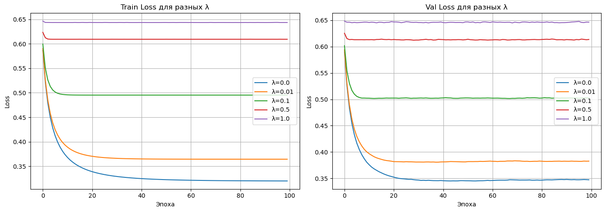
    


Реализация L2-регуляризации для кросс-энтропии заключается в добавлении к функции потерь штрафа за квадраты весов, что принудительно ограничивает их величину и предотвращает переобучение, заставляя модель искать более простые и обобщающие закономерности вместо запоминания шума в данных. Глядя на представленные графики, становится ясно, что при $\lambda=0.0$ модель обучается "на полную", показывая минимальную ошибку на тренировке, однако слишком высокие значения $\lambda$ (ближе к $1.0$) слишком сильно подавляют веса, приводя к недообучению и заметному росту ошибки. Таким образом, оптимальный баланс достигается при малом коэффициенте (в данном случае около $\lambda=0.01$), который позволяет модели оставаться достаточно гибкой для обучения, но защищает её от излишней сложности, обеспечивая наилучшее качество на валидационной выборке.

###  3. Метрики качества и анализ ошибок
Добавлил вычисление метрик на тестовой выборке:  precision, recall, F1-score, ROC-AUC. Для этого написал отдельную функцию для вычисленния ROC-AUC. 


```python
def roc_auc_score(y_true, y_scores):
    y_true = np.array(y_true)
    if np.min(y_true) == -1:
        y_true = (y_true + 1) // 2
    desc_score_indices = np.argsort(y_scores)[::-1]
    y_true = y_true[desc_score_indices]

    n_pos = np.sum(y_true == 1)
    n_neg = np.sum(y_true == 0)

    if n_pos == 0 or n_neg == 0:
        return 0.0

    tps = np.cumsum(y_true == 1)
    fps = np.cumsum(y_true == 0)

    tpr = tps / n_pos
    fpr = fps / n_neg

    tpr = np.r_[0, tpr]
    fpr = np.r_[0, fpr]

    return np.trapz(tpr, fpr)
```

И изменил функцию ```print_metrics``` (добавил ROC-AUC, остальные метрики уже добавил ранее)


```python
def print_metrics(name, y_true, y_pred, y_scores=None):
    y_true_norm = np.array(y_true)
    y_pred_norm = np.array(y_pred)
    if np.min(y_true_norm) == -1:
        y_true_norm = (y_true_norm + 1) // 2
        y_pred_norm = (y_pred_norm + 1) // 2

    tp = np.sum((y_true_norm == 1) & (y_pred_norm == 1))
    tn = np.sum((y_true_norm == 0) & (y_pred_norm == 0))
    fp = np.sum((y_true_norm == 0) & (y_pred_norm == 1))
    fn = np.sum((y_true_norm == 1) & (y_pred_norm == 0))

    acc = (tp + tn) / len(y_true_norm) if len(y_true_norm) > 0 else 0
    prec = tp / (tp + fp) if (tp + fp) > 0 else 0
    rec = tp / (tp + fn) if (tp + fn) > 0 else 0
    f1 = 2 * prec * rec / (prec + rec) if (prec + rec) > 0 else 0

    print(f"--- Метрики: {name} ---")
    print(f"Accuracy:  {acc:.4f}")
    print(f"Precision: {prec:.4f}")
    print(f"Recall:    {rec:.4f}")
    print(f"F1-score:  {f1:.4f}")

    if y_scores is not None:
        auc = roc_auc_score(y_true, y_scores)
        print(f"ROC-AUC:   {auc:.4f}")
    print("\n")
```

Построил ROC-кривую. Для этого написал функцию ```calculate_roc_curve```, которая вычисляет значения FPR и TPR для построения ROC-кривой и ```plot_roc_curve```, которая собственно выводит график.


```python
def calculate_roc_curve(y_true, y_scores):
    y_true = np.array(y_true)
    if np.min(y_true) == -1:
        y_true = (y_true + 1) // 2
    desc_score_indices = np.argsort(y_scores)[::-1]
    y_true_sorted = y_true[desc_score_indices]
    n_pos = np.sum(y_true_sorted == 1)
    n_neg = np.sum(y_true_sorted == 0)

    tps = np.cumsum(y_true_sorted == 1)
    fps = np.cumsum(y_true_sorted == 0)

    tpr = tps / n_pos
    fpr = fps / n_neg

    tpr = np.r_[0, tpr]
    fpr = np.r_[0, fpr]

    return fpr, tpr


def plot_roc_curve(fpr, tpr, roc_auc):
    plt.figure(figsize=(8, 6))
    plt.plot(fpr, tpr, color='darkorange', lw=2, label=f'ROC curve (AUC = {roc_auc:.4f})')
    plt.plot([0, 1], [0, 1], color='navy', lw=2, linestyle='--')
    plt.xlim([0.0, 1.0])
    plt.ylim([0.0, 1.05])
    plt.xlabel('False Positive Rate (FPR)')
    plt.ylabel('True Positive Rate (TPR)')
    plt.title('Receiver Operating Characteristic (ROC)')
    plt.legend(loc="lower right")
    plt.grid(True)
    plt.show()

data = DataProvider()
X_train, Y_train, X_test, Y_test = data.generate_and_prepare()
model = Perceptron()
model.fit(X_train, Y_train, X_test, Y_test, epochs=100, lr=0.1, batch_size=32)

y_scores_test = model.forward(X_test)
fpr, tpr = calculate_roc_curve(Y_test, y_scores_test)
roc_auc = np.trapezoid(tpr, fpr)
plot_roc_curve(fpr, tpr, roc_auc)

```


    
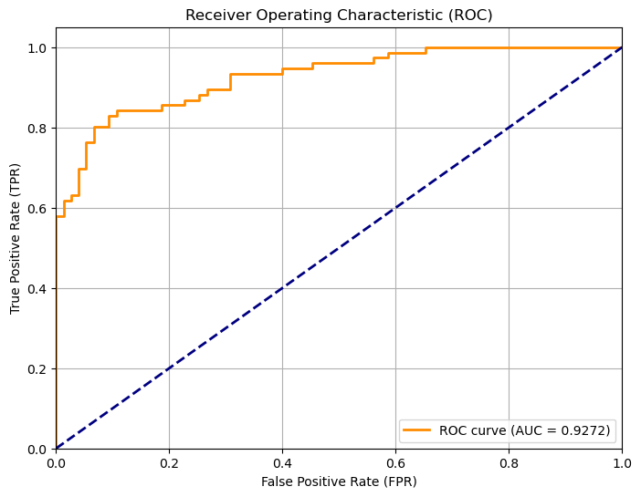
    


Теперь проанализирую какие примеры классифицируются ошибочно. Для этого визуализирую ошибки. Так как у нас 2 признака, мы можем построить решающую границу (линию, разделяющую классы) и увидеть, какие точки оказались "не на той стороне". Я написал для построения графика функцию ```plot_decision_boundary```


```python
def plot_decision_boundary(model, X_test, Y_test):
    y_pred = model.predict(X_test)
    error_indices = np.where(Y_test != y_pred)[0]
    correct_indices = np.where(Y_test == y_pred)[0]
    plt.figure(figsize=(10, 6))
    plt.scatter(X_test[correct_indices, 0], X_test[correct_indices, 1], 
                c=Y_test[correct_indices], cmap='coolwarm', alpha=0.6, label='Правильно')
    plt.scatter(X_test[error_indices, 0], X_test[error_indices, 1], 
                c='black', marker='x', s=100, label='Ошибка')
    w0, w1 = model.w[0], model.w[1]
    b = model.b
    
    x_range = np.array([X_test[:, 0].min() - 0.5, X_test[:, 0].max() + 0.5])
    y_range = -(w0 * x_range + b) / w1
    
    plt.plot(x_range, y_range, 'k--', label='Граница решения')
    plt.title('Визуализация ошибок классификации')
    plt.xlabel('Признак 1')
    plt.ylabel('Признак 2')
    plt.legend()
    plt.grid(True)
    plt.show()

plot_decision_boundary(model, X_test, Y_test)
```


    
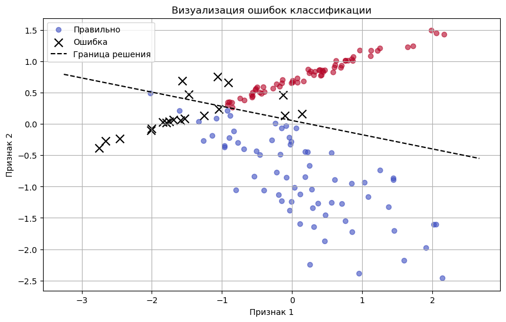
    


Ошибки классификации сосредоточены исключительно в пограничной зоне, где наблюдается естественное перекрытие (наложение) классов. В зонах с высокой плотностью одного класса ошибок не зафиксировано, что говорит об отсутствии переобучения и адекватном подборе весов.

### 4. Исследование сходимости градиентного спуска
Реализую градиентный спуск с моментом. Для этого изменю метод ```fit``` в классе перцептрона.


```python
class Perceptron:
    def __init__(self, loss_type='cross_entropy', l2_lambda=0.0):
        self.w = None
        self.b = None
        self.loss_type = loss_type
        self.l2_lambda = l2_lambda
        self.train_loss_history = []
        self.val_loss_history = []

    def sigmoid(self, z):
        z = np.clip(z, -250, 250)
        return 1 / (1 + np.exp(-z))

    def forward(self, X):
        z = np.dot(X, self.w) + self.b
        if self.loss_type == 'hinge':
            return z
        return self.sigmoid(z)

    def compute_loss(self, y_true, y_pred):
        if self.loss_type == 'cross_entropy':
            eps = 1e-15
            y_pred = np.clip(y_pred, eps, 1 - eps)
            loss = -np.mean(y_true * np.log(y_pred) + (1 - y_true) * np.log(1 - y_pred))
            if self.l2_lambda > 0 and self.w is not None:
                loss += (self.l2_lambda / 2) * np.sum(self.w**2)
            return loss
        else:
            losses = np.maximum(0, 1 - y_true * y_pred)
            return np.mean(losses)

    def fit(self, X_train, y_train, X_val=None, y_val=None, epochs=100, lr=0.1,
            batch_size=32, momentum=0.0, init_type='small_random'):
        n_samples, n_features = X_train.shape
        if init_type == 'zeros':
            self.w = np.zeros(n_features)
        elif init_type == 'large_random':
            self.w = np.random.randn(n_features) * 10.0
        else:
            self.w = np.random.randn(n_features) * 0.01

        self.b = 0.0
        v_w = np.zeros_like(self.w)
        v_b = 0.0

        self.train_loss_history = []
        self.val_loss_history = []

        for epoch in range(epochs):
            indices = np.arange(n_samples)
            np.random.shuffle(indices)
            X_shuffled = X_train[indices]
            y_shuffled = y_train[indices]

            for i in range(0, n_samples, batch_size):
                X_batch = X_shuffled[i:i + batch_size]
                y_batch = y_shuffled[i:i + batch_size]
                m_batch = X_batch.shape[0]

                y_pred = self.forward(X_batch)

                if self.loss_type == 'cross_entropy':
                    dw = np.dot(X_batch.T, (y_pred - y_batch)) / m_batch
                    db = np.sum(y_pred - y_batch) / m_batch
                    if self.l2_lambda > 0:
                        dw += self.l2_lambda * self.w
                else:
                    mask = (y_batch * y_pred) < 1
                    if np.any(mask):
                        dw = -np.dot(X_batch[mask].T, y_batch[mask]) / m_batch
                        db = -np.sum(y_batch[mask]) / m_batch
                    else:
                        dw = np.zeros_like(self.w)
                        db = 0.0
                if momentum > 0:
                    v_w = momentum * v_w + lr * dw
                    v_b = momentum * v_b + lr * db
                    self.w -= v_w
                    self.b -= v_b
                else:
                    self.w -= lr * dw
                    self.b -= lr * db
            self.train_loss_history.append(self.compute_loss(y_train, self.forward(X_train)))
            if X_val is not None and y_val is not None:
                self.val_loss_history.append(self.compute_loss(y_val, self.forward(X_val)))

    def predict(self, X):
        if self.loss_type == 'cross_entropy':
            return (self.forward(X) >= 0.5).astype(int)
        else:
            return np.where(self.forward(X) >= 0, 1, -1)
```

Теперь сравню его с обычным SGD на тех же данных.


```python
model_sgd = Perceptron(loss_type='cross_entropy')
model_sgd.fit(X_train, Y_train, epochs=50, lr=0.05)

model_mom = Perceptron(loss_type='cross_entropy')
model_mom.fit(X_train, Y_train, epochs=50, lr=0.05, momentum=0.9)

plt.plot(model_sgd.train_loss_history, label='SGD')
plt.plot(model_mom.train_loss_history, label='Momentum (0.9)')
plt.xlabel('Эпохи')
plt.ylabel('Loss')
plt.title('Сравнение сходимости SGD и Momentum')
plt.legend()
plt.grid(True)
plt.show()
```


    
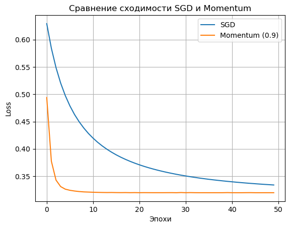
    


Метод Momentum достигает минимума функции потерь значительно быстрее (за ~5 эпох), тогда как стандартный SGD демонстрирует медленное снижение на протяжении всего процесса обучения. Этот метод является более эффективным для оптимизации параметров модели по сравнению с классическим градиентным спуском.


```python
betas = [0.5, 0.9, 0.99]
histories = {}

for beta in betas:
    model = Perceptron(loss_type='cross_entropy')
    model.fit(X_train, Y_train, epochs=50, lr=0.05, momentum=beta)
    histories[beta] = model.train_loss_history

plt.figure(figsize=(10, 6))
for beta, history in histories.items():
    plt.plot(history, label=f'Momentum (beta={beta})')

plt.title('Сравнение скорости сходимости при разных значениях Momentum')
plt.xlabel('Эпохи')
plt.ylabel('Loss')
plt.legend()
plt.grid(True)
plt.show()
```


    
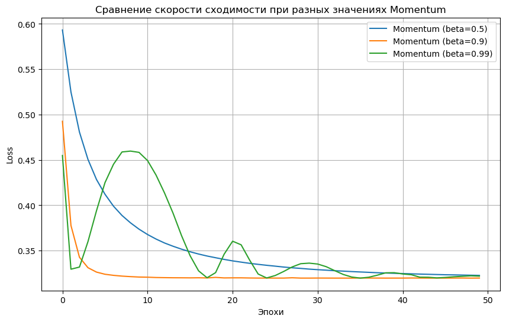
    


При $\beta = 0.99$ слишком высокое значение приводит к нестабильности. На графике заметны характерные осцилляции (колебания) вокруг минимума. Это происходит из-за того, что модель «проскакивает» точку оптимума, опираясь на чрезмерно накопленный градиент. Значение $\beta = 0.9$ является наиболее эффективным для данной задачи, обеспечивая максимальную скорость обучения при сохранении высокой стабильности. Чрезмерное увеличение импульса ведет к потере контроля над процессом оптимизации.

### 5. Кросс-валидация и подбор гиперпараметров
Реализую 5-кратную кросс-валидацию для подбора скорости обучения η и размера батча. Для этого напишу функцию ```cross_validate```, в которой буду ротировать данные, а затем перебирать скорость обучения и размер батча, обучать модель и подбирать лучшую комбинацию. Приведу результаты: 


```python
def cross_validate_with_stats(X, y, learning_rates, batch_sizes, k=5):
    n_samples = X.shape[0]
    fold_size = n_samples // k
    indices = np.arange(n_samples)
    np.random.shuffle(indices)
    
    folds = []
    for i in range(k):
        val_idx = indices[i * fold_size : (i + 1) * fold_size]
        train_idx = np.concatenate([indices[:i * fold_size], indices[(i + 1) * fold_size:]])
        folds.append((X[train_idx], y[train_idx], X[val_idx], y[val_idx]))

    results = []

    for lr in learning_rates:
        for bs in batch_sizes:
            fold_accuracies = []
            
            for X_tr, y_tr, X_val, y_val in folds:
                model = Perceptron(loss_type='cross_entropy')
                model.fit(X_tr, y_tr, epochs=30, lr=lr, batch_size=bs)

                preds = model.predict(X_val)
                acc = np.mean(preds == y_val)
                fold_accuracies.append(acc)

            mean_acc = np.mean(fold_accuracies)
            std_acc = np.std(fold_accuracies)
            
            results.append({
                'lr': lr, 
                'batch': bs, 
                'mean_acc': mean_acc, 
                'std_acc': std_acc
            })
            
    return results

lr_candidates = [0.001, 0.005, 0.01, 0.05, 0.1, 0.2, 0.5]
batch_size_candidates = [8, 16, 32, 64, 128]

stats = cross_validate_with_stats(X_train, Y_train, lr_candidates, batch_size_candidates, k=5)
top_results = sorted(stats, key=lambda x: x['mean_acc'], reverse=True)[:1]

for res in top_results:
    print(f"LR: {res['lr']}, Batch: {res['batch']} | Acc: {res['mean_acc']:.4f} ± {res['std_acc']:.4f}")
```

    LR: 0.05, Batch: 16 | Acc: 0.8812 ± 0.0281
    

Теперь наконец выберу лучшие гиперпараметры и обучу финальную модель на всех обучающих данных. Лучшая скорость обучения и размер батча: LR: 0.05, Batch: 16. Модель лучше работает с Momentum и $\beta = 0.9$, коэффициентом L2-регуляризации $\lambda=0.01$. Кросс-энтропия и hinge loss показывают сопоставимые результаты, так что использую кросс-энтропию.


```python
results_data = []
datasets = ['linear', 'xor', 'circle', 'DataProvider']

for dtype in datasets:
    if dtype == 'DataProvider':
        provider = DataProvider()
        X_tr, Y_tr, X_te, Y_te = provider.generate_and_prepare()
    else:
        X_tr, Y_tr, X_te, Y_te = generate(data_type=dtype)

    model = Perceptron(loss_type='cross_entropy', l2_lambda=0.01)
    model.fit(X_tr, Y_tr, X_te, Y_te, epochs=100, lr=0.05, batch_size=16, momentum=0.9)

    y_pred = model.predict(X_te)

    tp = np.sum((Y_te == 1) & (y_pred == 1))
    tn = np.sum((Y_te == 0) & (y_pred == 0))
    fp = np.sum((Y_te == 0) & (y_pred == 1))
    fn = np.sum((Y_te == 1) & (y_pred == 0))

    acc = (tp + tn) / len(Y_te)
    prec = tp / (tp + fp) if (tp + fp) > 0 else 0
    rec = tp / (tp + fn) if (tp + fn) > 0 else 0
    f1 = 2 * prec * rec / (prec + rec) if (prec + rec) > 0 else 0

    results_data.append((dtype, acc, prec, rec, f1))

print(f"{'Dataset':<20} | {'Accuracy':<10} | {'Precision':<10} | {'Recall':<10} | {'F1-Score':<10}")
print("-" * 75)
for res in results_data:
    print(f"{res[0]:<20} | {res[1]:<10.4f} | {res[2]:<10.4f} | {res[3]:<10.4f} | {res[4]:<10.4f}")
```

    Dataset              | Accuracy   | Precision  | Recall     | F1-Score  
    ---------------------------------------------------------------------------
    linear               | 0.9801     | 0.9737     | 0.9867     | 0.9801    
    xor                  | 0.5695     | 0.5695     | 1.0000     | 0.7257    
    circle               | 0.5364     | 0.0000     | 0.0000     | 0.0000    
    DataProvider         | 0.8675     | 0.8889     | 0.8421     | 0.8649    
    

На линейно разделимых данных модель показывает практически идеальный результат, для нелинейно разделимых данных перцептрон не предназначен.

# Заключение
В ходе выполнения данной лабораторной работы был реализован однослойный перцептрон с нуля, без использования готовых библиотек глубокого обучения. Это позволило глубоко понять внутренние механизмы обучения нейронных сетей, такие как прямой проход (forward pass), вычисление функции потерь и обновление весов. Работа позволила закрепить понимание фундаментальных принципов машинного обучения: от подготовки данных до анализа сходимости и оценки качества модели. Полученные навыки являются базой для изучения более сложных архитектур нейронных сетей.
